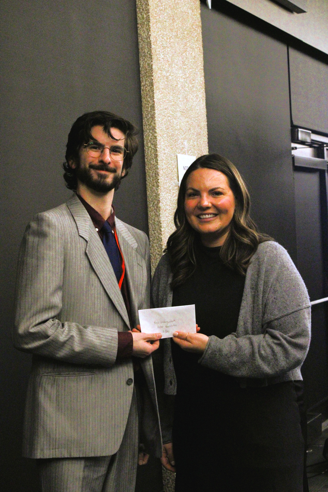

## Achievements

A summary of the academic and research awards I have achieved during my career. I hope to strive to continue to push the boundaries while forwarding science.

---

## Academic Awards

- Dr. A.W. Hogg Undergraduate Scholarship, 2025
    - Awarded for the highest standing in the Faculty of Environment, Earth, and Resources
- Clayton H. Riddell Faculty of Environment, Earth, and Resources Undergraduate Admission Award, 2024
    - Awarded to the nine highest ranking students who are enrolled full time in their second year of study
- UMSU Scholarship, 2024, 2025
    - For exceptional academic achievement. 
- Dean’s Honour List, Fall 2024, Winter 2025
    - For student enrolled in the faculty with a grade point average exceeding 3.5 during the semester awarded.

---

### 1st Place Poster, Western Inter-University Geoscience Conference 2026 

For my poster in the

---