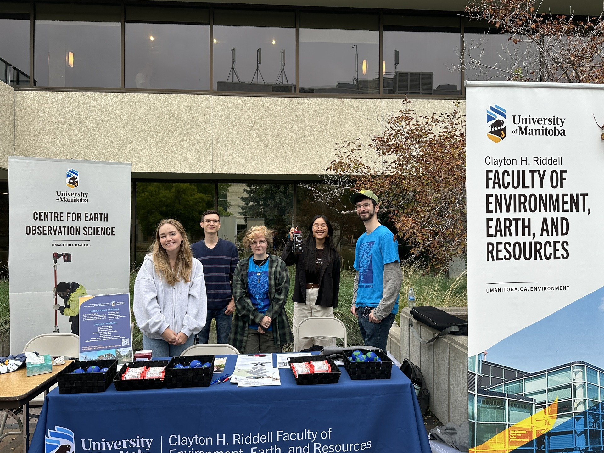

### Volunteering for University of Manitoba, Faculty of Environment, Earth, and Resources 

---

#### Welcome Day
I assisted the faculty in helping first year student find out about the faculty, encourage them to take environment, geography, and geology courses and also, get student interested in field work, storm chasing, and more!

---

#### Fall 2025 Open House
Helped to setup and run the tornado machine for the faculty booth on campus. Engaged with parents and prospective students about opportunities in the faculty and the job market. showcased the numerous different focus areas and concentrations across the environmental sectors available to people. 

---

#### Winter 2026 Open House
Again acting as the person to explain physical geography to projective students and parents, tailoring explanations of course requirements and course recommendations for each ones needs. Sparking interest in the opportunities in the environments and earth focused fields of science. 

---
