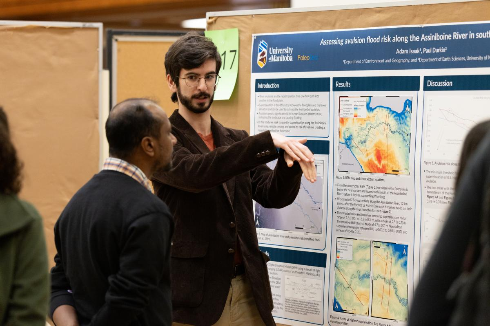

## 2025 University of Manitoba Undergraduate Research Showcase

---

At this event I presented my poster on *Assessing avulsion flood risk along the Assiniboine River in southwestern Manitoba*. Where I showcased the project in detail detailing how the sections of the Assiniboine River that are superelevated above it's surrounding floodplain places them at an elevated risk of an avulsion-type flood event in teh future. Key aspects of my presentation were:
- Focusing on keeping the messaging of the research straightforward in order for it to be communicated to a wide public audience.
- Visualized a large dataset into it's key takeaways allowing the poster to guide readers through my material without require assistance from my presentation.
- Discussed with other student researchers and the public about my research and other research being presented at the showcase, to think of broad applications of the research.

[View the poster here](/projects/assiniboine-river/poster.pdf)