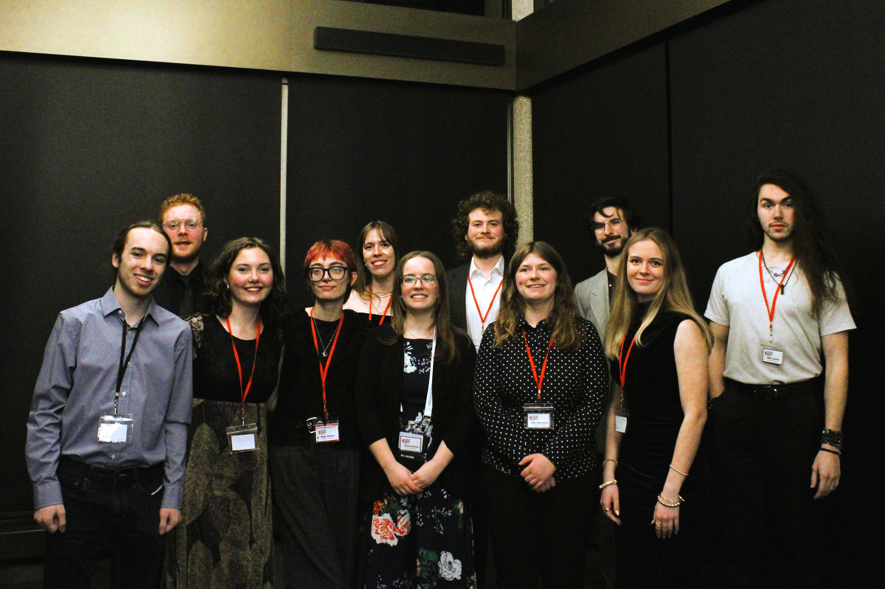
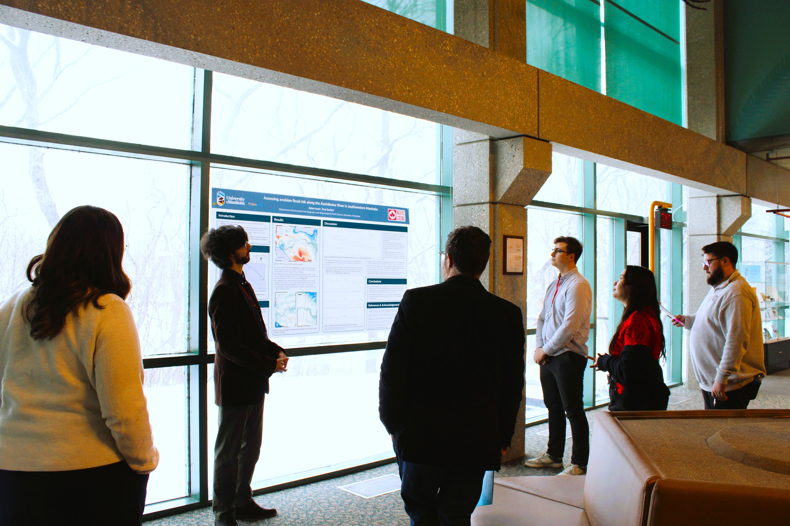

## Western Inter-University Geoscience Conference 2026

I was a part of the committee hosting the WIUGC 2026 conference at the University of Manitoba, where  acted as the IT support for the whole event. I ensured that the event ran smoothly through all projectors, presentations, trivia game show, and whatever else, while also creating and maintaining the conferences website. While also assisting in setting up and organizing the event.

During the event the following key events:
- Short Course - Efficiently setup and prepared the room and slides decks for the presentation allowing it to run according to schedule with no interference.
- Rockbreaker - Engaged with professional and sisters schools and attendees
- Talks - Organized the presentations and AV equipment so that the talks and discussion panel had no technical difficulties.
- Careers Fair - Assisted all professional to ensure they had power and all their equipment for their booths. 
- Poster Competition - Exhibited my poster to both the judge and teh general public explain the risks presented by the Assiniboine Rivers superelevation. 
- Challenge bowl - Prepared the AV equipment for the trivia game, and troubleshot through difficulties to ensure the event occurred on time with minimize connection issues.

I was fortunate enough to also have my poster "[Assessing avulsion flood risk along the Assiniboine River in southwestern Manitoba](/projects/assiniboine-river/poster.pdf)" submitted in the event, where it won 1st Place.

