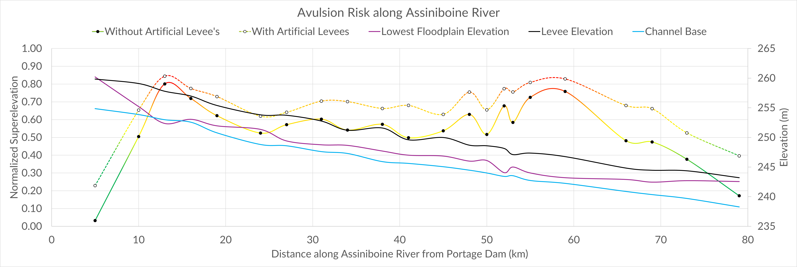

## Researching avulsion risk along the Assiniboine River in southwestern Manitoba using remote sensing

*Project Supervisor:* [Dr. Paul Durkin](https://umanitoba.ca/environment-earth-resources/paul-durkin-profile-page) ([Google Scholar](https://scholar.google.com/citations?user=KeTNzo0AAAAJ&hl=en))

---

The Assiniboine River has had a long record of avulsion in the past, this project was focused on finding a method to quantify the likelihood of an avulsion occurring along the channels length. Over the course of summer 2025 using techniques from literature, I extracted cross sections of the river in GIS software from LiDAR data of the Assiniboine River channel to find the superelevation of the channel from which the superelevation could be derived. The techniques and results of the project were then summarized into a poster of the findings, before being compiled into a report.

---
### Media

---

### Poster 

**Assessing avulsion flood risk along the Assiniboine River in southwestern Manitoba**

Displayed at: 
- [University of Manitoba 2025 Undergraduate Research Showcase](/engagement/undergraduate-research-showcase-2025).
- [2026 Western Inter-University Geosciences Conference](/engagement/wiugc-2026).

[Poster Available Here](poster.pdf)

--- 

### Report

#### Abstract
The Assiniboine River has a history of avulsions around Portage la Prairie, evidenced by it’s record of paleochannels. The river is at an elevated risk of having an avulsion type flood, due to the superelevation of the channel above it’s surrounding floodplains. The purpose of this project was to quantify the risk of an avulsion occurring on the Assiniboine River by gathering superelevation data along the channel. Superelevation can be used to assess the relative likelihood of an avulsion occurring when it is normalized to the channel depth. The data was gathered using QGIS and remotely sensed Light Detection and Ranging (LiDAR) data to construct a digital elevation model (DEM). Using the DEM we gathered 22 cross sections, from which we extracted the elevations of the levees, floodplain, water surface elevation, and the channel width, across 79 km of the river sinuosity beginning at the Portage la Prairie dam. The average superelevation ranged between 0.2 m and 3.7 m, with a mean of 2.5 m. The superelevation was normalized giving ratios between 0.03 (± 0.002) to 0.80 (± 0.058), with a mean of 0.54 (± 0.153). The highest ratio results were found at 13 km, 55 km and 59 km downstream of the Portage la Prairie Dam, with 0.80 (± 0.058), 0.73 (± 0.060), and 0.76 (± 0.033) respectively. The normalized superelevation exceeded the minimum threshold of 0.5 between 10 km and 66 km downstream of the Portage Dam, the region around the Assiniboine is at an elevated risk of an avulsion occurring, which poses a significant threat to the surrounding communities and individuals that live near the river. An avulsion would result in catastrophic flooding and the establishment of the Assiniboine River in a completely new flow path. An avulsion of the Assiniboine River would reshape much of southwestern Manitoba in innumerable ways, dramatically changing the landscape as the old flow path is abandoned. The nature of the Assiniboine River’s seasonal flooding and ice jams serve as triggers for an avulsion, compounding the risk. Flood control mechanisms have controlled for avulsion in the past, however the current reliance on embankments are not effective at mitigating avulsion risk. More research is required to quantify and model future avulsion paths and get a more accurate measure of avulsion risk along the channel. Nonetheless, the methods used to utilize remotely sensed LiDAR imagery in this project should serve as a template for a more accessible method of assessing river avulsion risk on other rivers in the future.

*Report available upon request*

---