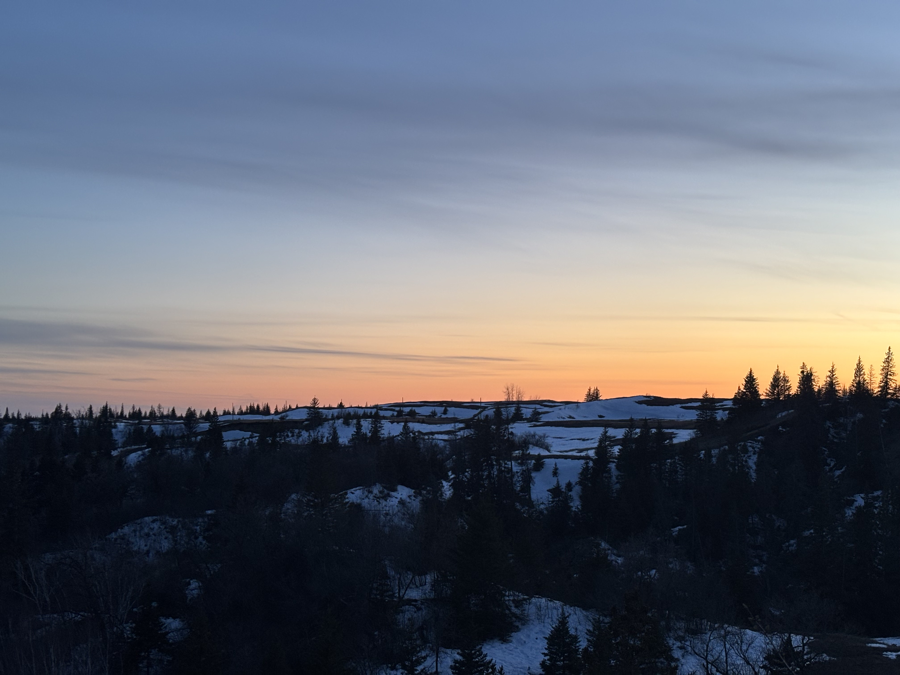

# Training

A view into my background of education, recent experiences and my core skills areas relevant to my work in glaciology and geomorphology. 

---

## Education
### Bachelors of Physical Geography, Honours (2023 - Present)
*University of Manitoba, Winnipeg, Manitoba*  
**GPA:** 4.33 / 4.5

### Software Development Diploma (2020 - 2021)
*Manitoba Institute of Trades and Technology*  
**GPA:** 4.4 / 4.5

---

## Recent Experience
#### Student Researcher
*April 2026 - Present*  
*University of Manitoba, Centre for Earth Observation Science*
Researching double basal channels on the Antarctica ice shelves in [CEOS](https://umanitoba.ca/earth-observation-science/) with the Blue Ice Group. Practically applying glaciology, remote sensing, programming, and GIS skills.  
- ([View project here](/projects/double-basal-channels)) 

#### Student Researcher
*May 2025 - August 2025*  
*University of Manitoba, Department of Earth Sciences*
A student researcher in the [Paleosed+](https://www.paleosed.ca/) research group for the summer 2025, assisting in field work, and conducting research on the Assiniboine River. Visualizing the possibilities using QGIS and GIS principles with LiDAR data.
- ([View project here](/projects/assiniboine-river))

---

