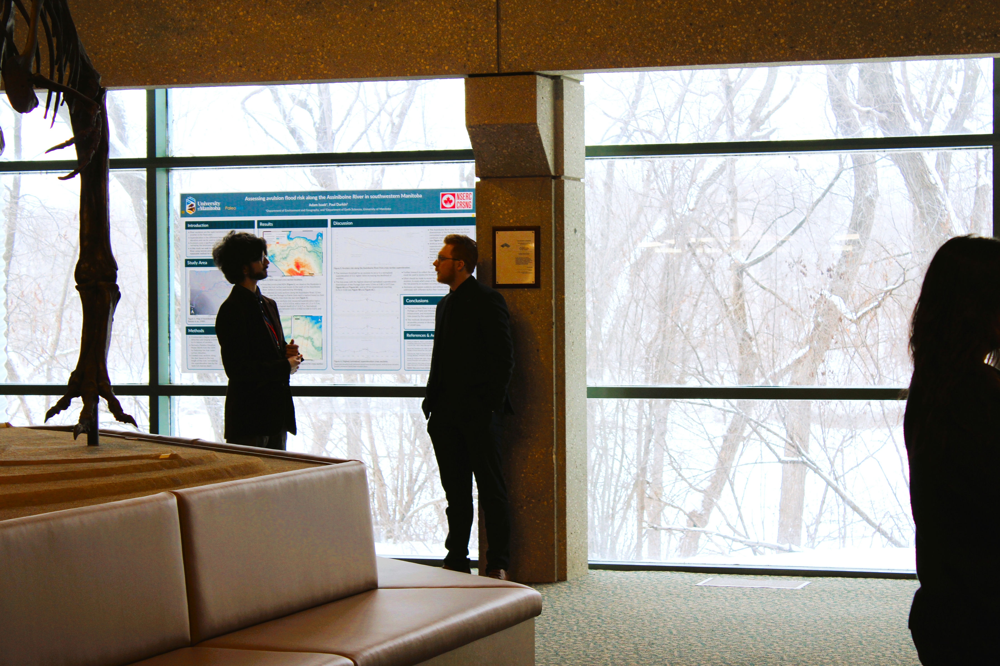

A broad overlook of my skills in communication leadership, through the lens of project management and training courses I have received. Communication and leadership are vital skills for any these are the following show how those skills were developed and how I applied them.

---

### Training
During my time enrolled in my **Software Development Diploma** at *Manitoba Institute of Trades and Technology*, I was fortunate to have official training on professional communication, technical writing, presentations and public speaking, and project management. These skills have allowed me to:
- Create comprehensive but understandable reports on website traffic to shareholders.
- Write effective and detailed minutes during committee meetings.
- Independently manage servers, bug fixes, website updates, properly prioritizing issues and task, while ensuring maintain, meeting deadlines without direct supervision. 

---

### Project Management

My project management skill have been
- Successfully organized, directed and brought an entire adventure game to completion for a school project intended as to be a demo.
- Self-directed and managed the Assiniboine River research project to keep objective within scope and on track. 
- Organized hackathon members to maximize their strengths, and pushed them to meet their potential during the presentation.

---