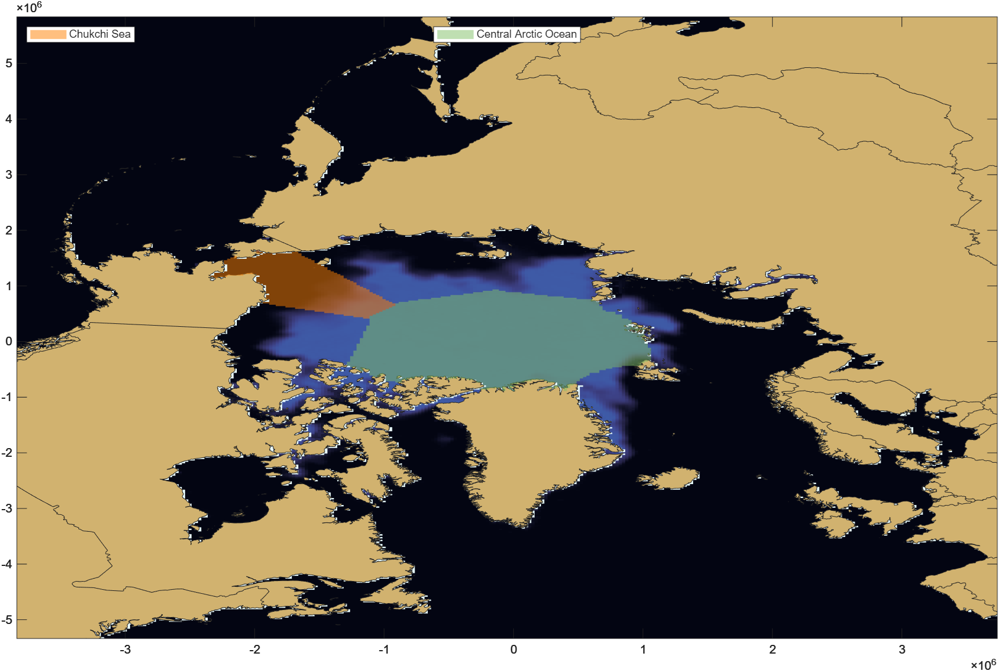

A summary of all of my programming experience and skills across a wide number of coding languages, applications, and role, along with how they are now applying to my research work. 

---

### Education
I was formally trained in programming, by taking three years of computer science in high school where I learned the fundamentals in C++ and C#. I took the programming skills and applied them as I took my **Software Development** at the *Manitoba Institute of Trades and Technology*. I gained the following skill-set from the experience:
- Proficient in programming languages: C++, C#, Javascript, HTML, CSS.
- Server management using: Bash Scripting, Node.JS, Linux.
- Database management and creation: SQL syntax, SQL scripting, SQL Server
- How to create and work with Application Program Interfaces
- Efficient technical writing and communication to communicate complex ideas to the general public

---

### Software Development Work
Working as full time software developer I further honed my skills in programming in a startup quickly learning and applying new skills to rapidly build out a new website.
- Utilized Javascript, HTML, CSS, Laravel, PHP, MySQL, Docker
- Managed server infrastructure for the website and ensured regular backups and deployments of new code
- Connected with external API's to boost website functionality.

---

### Research
Now transitioning from a traditional role into research I now use new programming tools, and seek to use programming paradigms to improve modeling and analysis efficiency. 
- Utilizing MATLAB to create temperature models and glacial flow models.
- Applying R to conduct statistical analysis of datasets.
- Creating python scripts and SQL queries in QGIS and ArcGIS to manage spatial data.

---